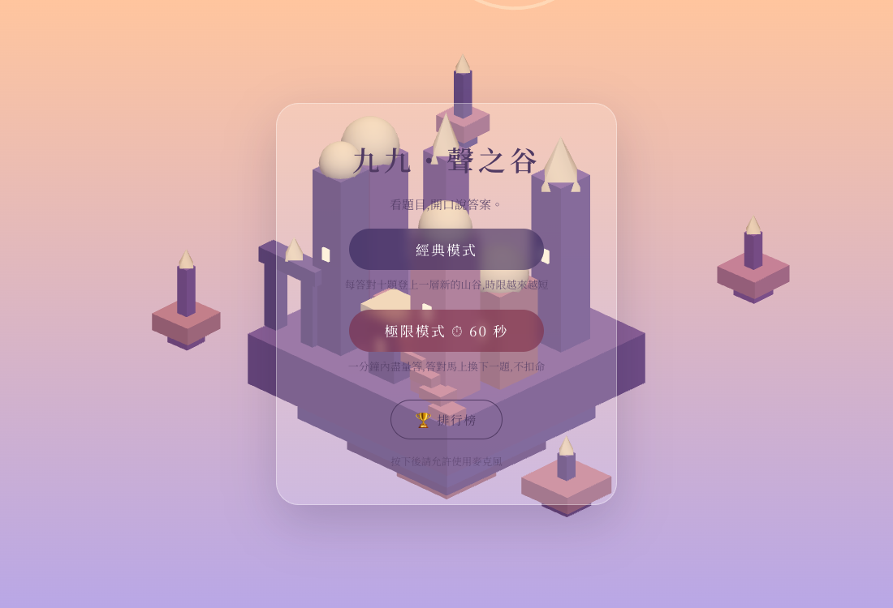

# 九九・聲之谷 🏔️🔢

> 用「說」的九九乘法表挑戰——看題目、開口答,語音辨識幫你判定對錯。

**🎮 馬上玩:<https://stratocaster59s.github.io/99-challenge/>**

(請用 Chrome / Edge / Safari 開啟,第一次會請求麥克風權限;辨識語言為中文)



## 這是什麼?

一個免安裝、零後端的網頁遊戲。螢幕跑出乘法題(例如 `7 × 8`),你直接**開口說答案**,遊戲即時辨識並判定——說對立刻過關,不用等倒數跑完。視覺風格向 Monument Valley 致敬:等距視角的浮空聖殿、粉彩漸層天空,**每一關都會程序化生成一座新的場景**。

### 兩種模式

| | 經典模式 | 極限模式 ⏱ |
|---|---|---|
| 玩法 | 每答對 10 題升一級,3 條命 | 60 秒內盡量答,答對馬上換下一題,不扣命 |
| 時限 | 每題 8 秒起,逐級遞減到 2.5 秒 | 只有全域 60 秒倒數 |
| 題目 | 隨等級擴大範圍、加重易錯題 | 2~9 全範圍,排除個位數答案(單音節難辨識) |

成績會記進**本地排行榜**(localStorage,各模式前 10 名)。

## 為什麼語音辨識聽得懂?

語音答題最大的坑:ASR 會把「五十六」聽成「我是六」、把「九」聽成「就」。本專案在 Web Speech API 之後自己加了一層**領域解讀層**([`src/game/parseAnswer.ts`](src/game/parseAnswer.ts)),由嚴到寬四層判定:

1. **直接解析**——阿拉伯數字與中文數字(含「五六」這種省略「十」的口語)
2. **贅詞剝除**——「答案是 56」「應該是六十三」
3. **同音字校正**——約 120 個常見誤辨字映射回數字(我是六 → 五十六)
4. **十/四混淆容錯**——shí/sì 是中文 ASR 最常見的錯

另外支援**口訣式回答**(直接唸「七八五十六」也算對)、同一數字重複講的折疊(「66」→ 6)、並同時檢查辨識引擎回傳的全部候選結果。中文數字解析用「極大視窗」演算法,確保「四十二」不會被誤拆出 12 這種假候選。

## 技術

- **語音辨識**:Web Speech API(瀏覽器內建,免費、免金鑰)+ 自製中文數字解讀層
- **3D 場景**:Three.js 正交相機等距視角,以關卡數為種子程序化生成建築群,Lambert 材質讓方塊三面自然分光
- **音效**:Web Audio 即時合成(答對琶音/答錯低鳴/升級號角),零音檔
- **框架**:Vite + React + TypeScript,純靜態部署於 GitHub Pages
- **零後端、零付費 API**:所有運算都在玩家的瀏覽器裡

## 本地開發

```bash
npm install
npm run dev    # http://localhost:5173
npm run build  # 產出 dist/
```

推上 `main` 分支會由 GitHub Actions 自動部署到 GitHub Pages。

## 專案結構

```
src/
├─ App.tsx                    # 遊戲狀態機(出題→聽答→判定→升級)
├─ game/
│  ├─ parseAnswer.ts          # ASR 後處理:同音字/口訣/容錯解讀層
│  ├─ questions.ts            # 洗牌牌堆出題(一輪內不重複)
│  ├─ levels.ts               # 等級、時限、主題配色
│  └─ leaderboard.ts          # localStorage 排行榜
├─ speech/useSpeech.ts        # Web Speech API 封裝(多候選、靜音續聽)
├─ components/LevelBackground.tsx  # Three.js 程序化等距場景
└─ audio/sfx.ts               # Web Audio 合成音效
```

## License

MIT
